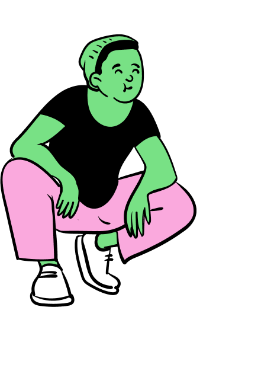
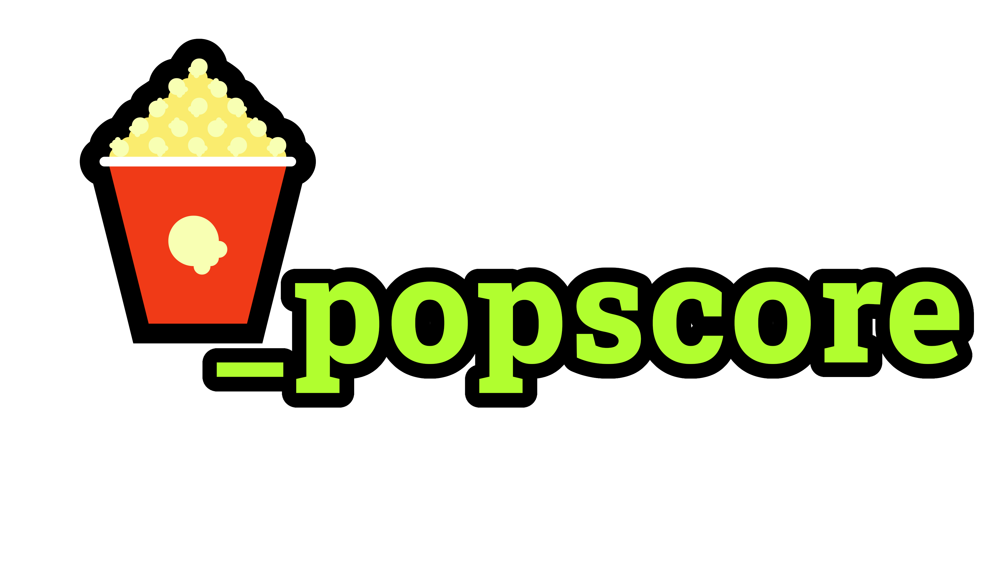
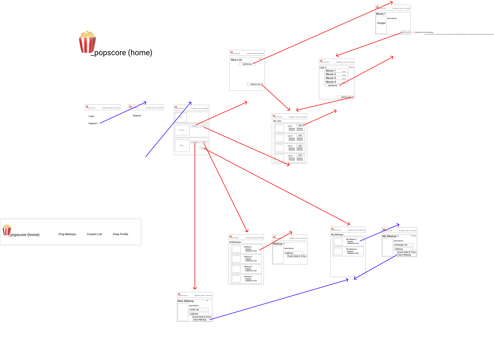

#  🍿_popscore is a React App 
for organizing movie watch parties

Developed by [Jackson Goodman](https://github.com/jacksonrgoodman), For Cohort 47's Front-End Capstone
## Installation
1. git clone this repository

## Usage
1. Run `json-server -p 8088 -w database.json`  in api directory of project
2. Run `npm start` in root of project
3. Test features. Register and add movie lists.

## Contributing
[Jackson Goodman](https://github.com/jacksonrgoodman)  

## License
[MIT](https://choosealicense.com/licenses/mit/)

